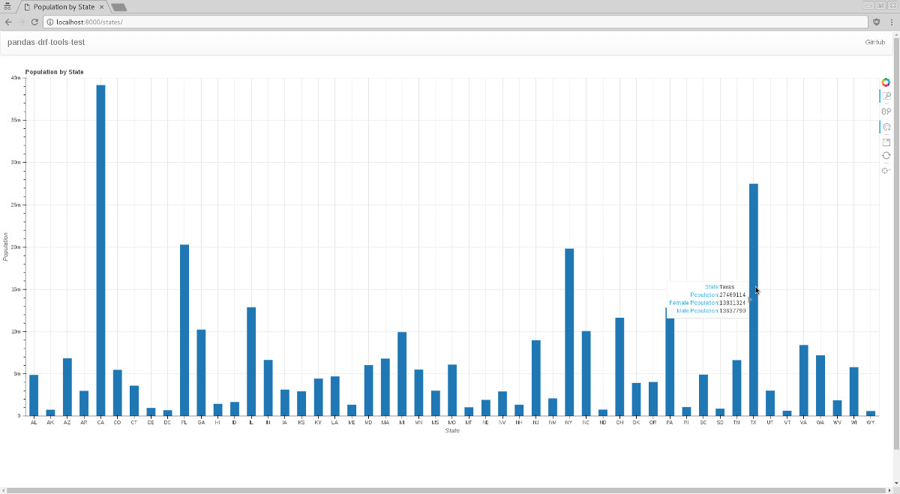

# pandas-drf-tools-test

This project shows you how to use [pandas-drf-tools](https://github.com/abarto/pandas-drf-tools) with a live [Django REST Framework](http://www.django-rest-framework.org/) site that generates [Bokeh](http://bokeh.pydata.org/en/latest/) charts from information stored in [Pandas](http://pandas.pydata.org/) data frames. The data is taken from the [US Census Bureau](http://www.census.gov/) site.

A `Vagrantfile` is provided if you wish to test the project in a live environment. Bare in mind that the provisioning script **downloads a lot of data** from the Census site.

## States Population Estimates

The first part of the project shows what I think is going to be the most common use case for the [pandas-drf-tools](https://github.com/abarto/pandas-drf-tools) package, and that is taking an existing DataFrame and exposing it so a front-end application can make use of the data.

```python
@lru_cache()
def get_cc_est2015_alldata_df():
    try:
        data = path.join(path.abspath(path.dirname(__file__)), 'data')
        cc_est2015_alldata_df = pd.read_pickle(path.join(data, 'CC-EST2015-ALLDATA.pkl'))
        state_df = get_state_df()[['STATE', 'STUSAB']]
        cc_est2015_alldata_df = cc_est2015_alldata_df.merge(state_df, on=('STATE',))
    except FileNotFoundError as e:
        raise ImproperlyConfigured(
            'Missing data file. Please run the "download_census_data" management command.') from e

    return cc_est2015_alldata_df


@lru_cache()
def get_state_df():
    try:
        data = path.join(path.abspath(path.dirname(__file__)), 'data')
        state_df = pd.read_pickle(path.join(data, 'state.pkl'))
    except FileNotFoundError as e:
        raise ImproperlyConfigured(
            'Missing data file. Please run the "download_census_data" management command.') from e

    return state_df
```

The data is presented to the user using [Bokeh](http://bokeh.pydata.org/en/latest/) charts. The charts are generated by two views. The first one shows the population of each state:

```python
def get_state_abbreviations():
    alldata_df = get_cc_est2015_alldata_df()
    return alldata_df['STUSAB'].drop_duplicates().tolist()


def get_states_plot():
    source = AjaxDataSource(
        data={'STATE': [], 'STNAME': [], 'STUSAB': [], 'TOT_POP': [], 'TOT_MALE': [], 'TOT_FEMALE': []},
        data_url='/api/states/', mode='replace', method='GET')

    hover = HoverTool(
        tooltips=[
            ("State", "@STNAME"),
            ("Population", "@TOT_POP"),
            ("Female Population", "@TOT_FEMALE"),
            ("Male Population", "@TOT_MALE"),
        ]
    )

    plot = figure(title='Population by State', plot_width=1200, plot_height=500,
                  x_range=FactorRange(factors=get_state_abbreviations()), y_range=(0, 40000000),
                  tools=[hover, 'tap','box_zoom','wheel_zoom','save','reset'])
    plot.toolbar.active_tap = 'auto'
    plot.xaxis.axis_label = 'State'
    plot.yaxis.axis_label = 'Population'
    plot.yaxis.formatter = NumeralTickFormatter(format="0a")
    plot.sizing_mode = 'scale_width'
    plot.vbar(bottom=0, top='TOT_POP', x='STUSAB', legend=None, width=0.5, source=source)

    url = "/counties/@STATE/"
    taptool = plot.select(type=TapTool)
    taptool.callback = OpenURL(url=url)

    return plot


class StatesView(TemplateView):
    template_name = 'chart.html'

    def get_context_data(self, **kwargs):
        context_data = super().get_context_data(**kwargs)

        plot = get_states_plot()
        bokeh_script, bokeh_div = components(plot, CDN)

        context_data['title'] = 'Population by State'
        context_data['bokeh_script'] = bokeh_script
        context_data['bokeh_div'] = bokeh_div

        return context_data
```
This view illustrates the guidelines given for [embdding Bokeh charts](http://bokeh.pydata.org/en/latest/docs/user_guide/embed.html). The interesting parts lies in the usage of ``AjaxDataSource``. When the chart is rendered in the front-end, it'll make a ``GET`` request to the supplied URL to fetch the data. Here's where pandas-drf-tools comes into play. The request is handled by a ``ReadOnlyDataFrameViewSet`` that exposes the dataframe constructed above.

```python
class StateEstimatesViewSet(ReadOnlyDataFrameViewSet):
    serializer_class = DataFrameListSerializer
    pagination_class = LimitOffsetPagination

    def get_dataframe(self):
        alldata_df = get_cc_est2015_alldata_df()

        state_names_df = alldata_df[['STATE', 'STNAME', 'STUSAB']].set_index('STATE')\
            .drop_duplicates()
        latest_total_population = alldata_df[(alldata_df.YEAR == 8) & (alldata_df.AGEGRP == 0)]
        population_by_state = latest_total_population.groupby(['STATE']).sum().join(state_names_df)\
            .reset_index()

        return population_by_state[['STATE', 'STNAME', 'STUSAB', 'TOT_POP', 'TOT_MALE', 'TOT_FEMALE']]
```

The ``DataFrameListSerializerDataFrameListSerializer`` used in this view is compatible with the format that Bokeh uses, so there's nothing else to do. If you click on state column, a chart is going to be show with the top ten counties (by population) on said state. This view is handled with a regular Django view with an embedded Bokeh chart:

```python
def get_counties_data_frame(state_fips_code):
    alldata_df = get_cc_est2015_alldata_df()
    county_names_df = alldata_df[['STATE', 'COUNTY', 'CTYNAME']].set_index('COUNTY') \
        .drop_duplicates()
    latest_total_population = alldata_df[(alldata_df.YEAR == 8) & (alldata_df.AGEGRP == 0)]
    population_by_county = latest_total_population.groupby(['COUNTY']).sum() \
        .join(county_names_df).reset_index()

    population_by_county = population_by_county[['STATE', 'COUNTY', 'CTYNAME', 'TOT_POP', 'TOT_MALE', 'TOT_FEMALE']]
    population_by_county = population_by_county[population_by_county.STATE == state_fips_code]
    population_by_county = population_by_county.sort_values('TOT_POP', ascending=False)[:10]

    return population_by_county

def get_counties_plot(data_frame):
    plot = Bar(data_frame, label='CTYNAME', values='TOT_POP', agg='max', plot_width=1200, plot_height=500,
               title='Population by County', legend=False)
    plot.xaxis.axis_label = 'County'
    plot.yaxis.axis_label = 'Population'
    plot.yaxis.formatter = NumeralTickFormatter(format="0a")
    plot.sizing_mode = 'scale_width'
    return plot

class CountiesView(TemplateView):
    template_name = 'chart.html'

    def get_context_data(self, **kwargs):
        context_data = super().get_context_data(**kwargs)

        data_frame = get_counties_data_frame(kwargs['state_fips_code'])
        plot = get_counties_plot(data_frame)
        bokeh_script, bokeh_div = components(plot, CDN)

        context_data['title'] = 'Population by County'
        context_data['bokeh_script'] = bokeh_script
        context_data['bokeh_div'] = bokeh_div

        return context_data
```



## DataFrameViewSet

The second part shows you how to manipulate a dataframe as if it were a queryset, allowing you not only to list rows of the dataset, but also creating new rows, and updating and deleting existing ones. This time we're going to use a different data set that only contains state population estimates:

```python
def get_nst_est2015_alldata_df():
    df = cache.get('nst_est2015_alldata_df')

    if df is None:
        try:
            data = path.join(path.abspath(path.dirname(__file__)), 'data')
            df = pd.read_pickle(path.join(data, 'NST-EST2015-alldata.pkl'))
            df = df[df.SUMLEV == '040'][['STATE', 'NAME', 'POPESTIMATE2015']].reset_index(drop=True)
            cache.set('nst_est2015_alldata_df', df)
        except FileNotFoundError as e:
            raise ImproperlyConfigured(
                'Missing data file. Please run the "download_census_data" management command.') from e

    return df
```

The dataframe is then exposed through a `DataFrameViewSet` that illustrates how to make the changes stick by implementing the `update_dataframe` method. The `index_row` was overridden so we can reference the states based on their FIPS code instead of their position within the dataframe.

```python
class TestDataFrameViewSet(DataFrameViewSet):
    serializer_class = DataFrameRecordsSerializer

    def index_row(self, dataframe):
        return dataframe[dataframe.STATE == self.kwargs[self.lookup_url_kwarg]]

    def get_dataframe(self):
        return get_nst_est2015_alldata_df()

    def update_dataframe(self, dataframe):
        cache.set('nst_est2015_alldata_df', dataframe)
        return dataframe
```

This set-up allows us to list rows:

```
$ curl --silent http://localhost:8000/api/test/ | python -mjson.tool
{
    "columns": [
        "index",
        "STATE",
        "NAME",
        "POPESTIMATE2015"
    ],
    "data": [
        [
            0,
            "01",
            "Alabama",
            4858979
        ],
        ...
        [
            51,
            "72",
            "Puerto Rico",
            3474182
        ]
    ]
}
```

...,get the details of a specific row...


```
$ curl --silent http://localhost:8000/api/test/72/ | python -mjson.tool
{
    "columns": [
        "index",
        "STATE",
        "NAME",
        "POPESTIMATE2015"
    ],
    "data": [
        [
            51,
            "72",
            "Puerto Rico",
            3474182
        ]
    ]
}
```

...add new rows...

```
$ curl --silent -X POST -H "Content-Type: application/json" --data '{"columns":["index","STATE","NAME","POPESTIMATE2015"],"data":[[52,"YY","Mars",1]]}' http://localhost:8000/api/test/
{"columns":["index","STATE","NAME","POPESTIMATE2015"],"data":[[52,"YY","Mars",1]]}
```

...update existing rows...

```
$ curl --silent -X PUT -H "Content-Type: application/json" --data '{"columns":["index","STATE","NAME","POPESTIMATE2015"],"data":[[52,"YY","Mars",0]]}' http://localhost:8000/api/test/YY/
```

...and delete rows...

```
$ curl --silent -X DELETE http://localhost:8000/api/test/YY/
```

It provides pretty much the same functionality as regular DRM `ModelViewSet`s.

## Feedback

Comments, tickets and pull requests are welcomed. Hit
me up on Twitter at [@m4rgin4l](<https://twitter.com/m4rgin4l>) if you
have specific questions.
